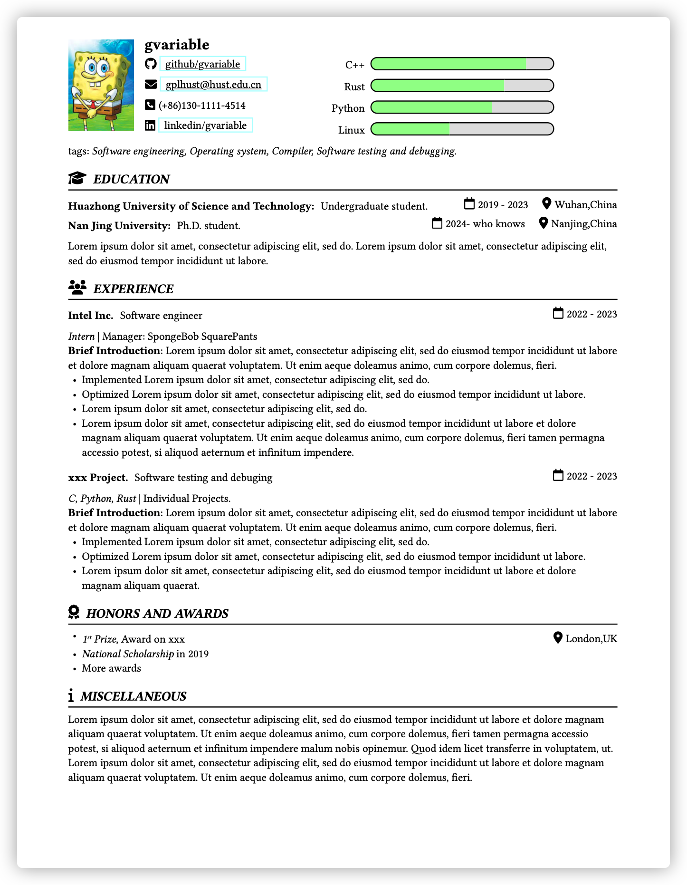

# Billryan Typst
Here is a very simple and minimalist resume template, inspired by 
- [Resume by Billryan](https://github.com/billryan/resume)
- [Alta Typst by George Honeywood](https://github.com/GeorgeHoneywood/alta-typst)

## Showcase
Here is a screenshot of the resume.
.  
see [`demo.pdf`](demo.pdf) for the pdf version.
## Features
- Beginner-friendly with the power of [markup-based typesetting system](https://typst.app/docs/reference/syntax/).
- Plug and play in a few minutes.
- Easy to extend or customize.
- What you see is what you get thanks to the [Typst](https://typst.app).

## Usage
### Online
1. Edit in online template in [Typst app](https://typst.app/project/pX25kHTO1yt1WmO2E4z6uZ).
### Locally
1. Clone this repo locally. 
    ```bash
    git clone https://github.com/gvariable/billryan-typst.git
    ```
2. Download the [Typst](https://github.com/typst/typst) compiler.
3. Use your favorite text editor to edit the `demo.typ` file such as Visual Studio Code with Typst LSP extension installed.
4. Compile it with Typst.
    ```bash
    typst compile demo.typ
    ```

## Todos
- [ ] Fix the bug of the progress bar.
- [ ] Better documentation.
